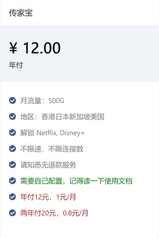
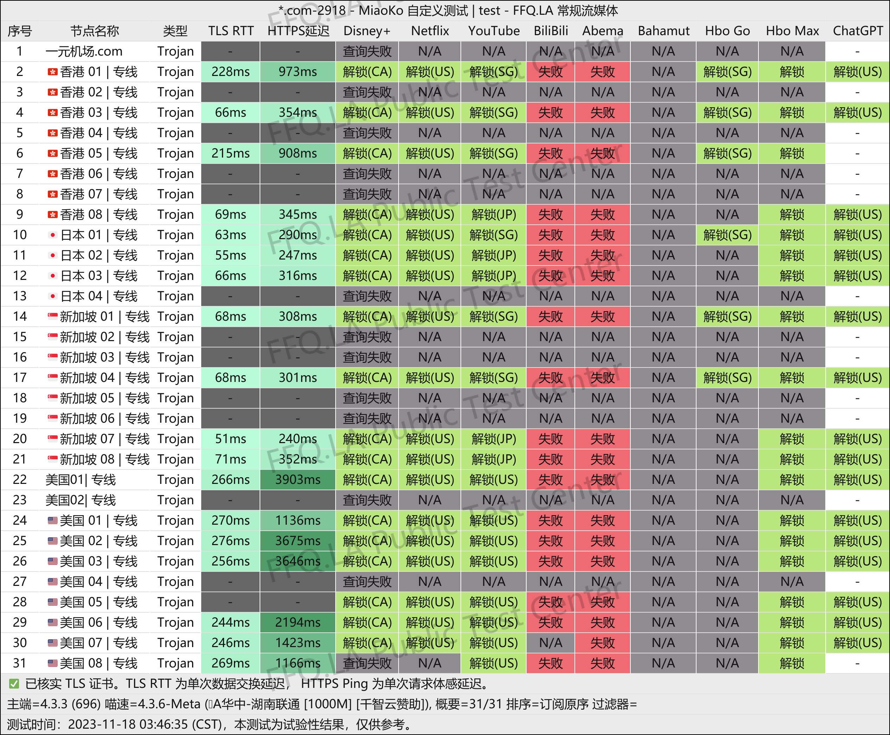
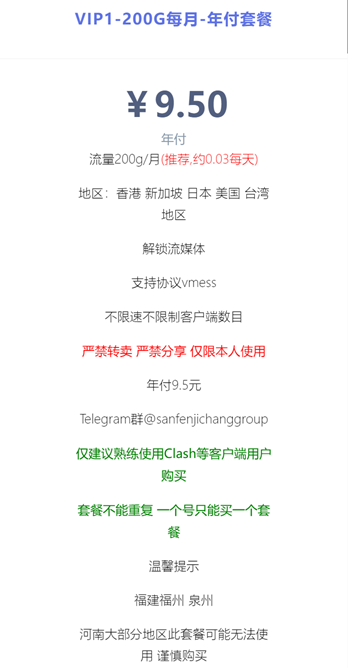
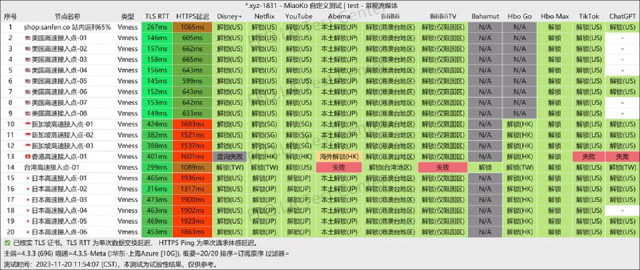
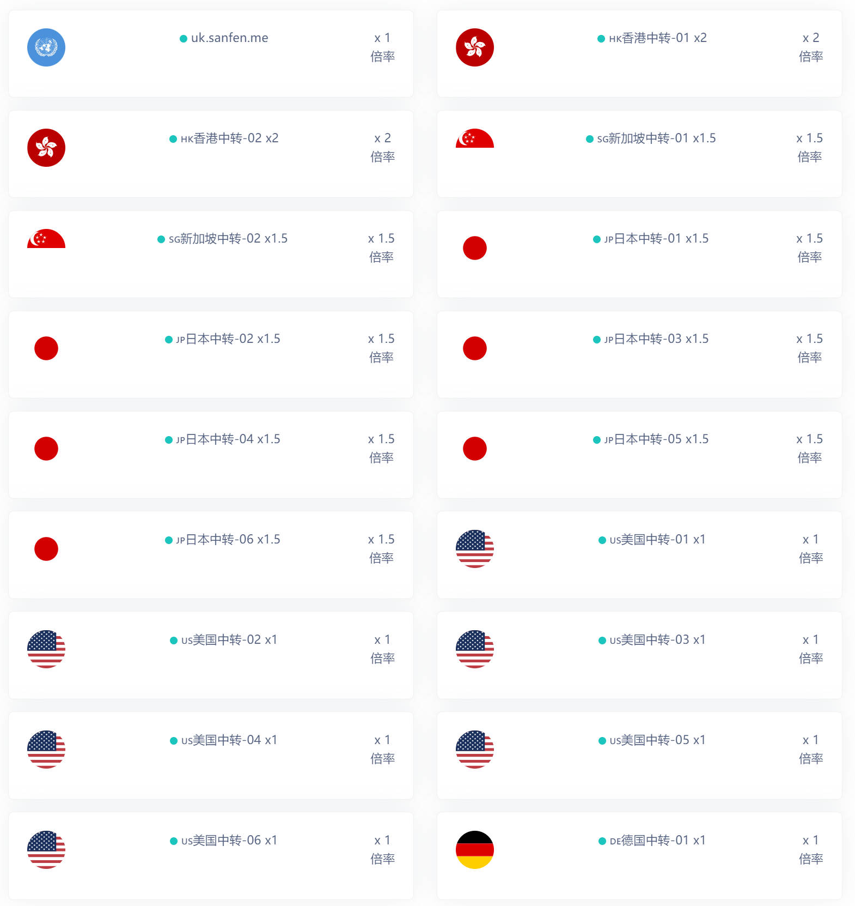
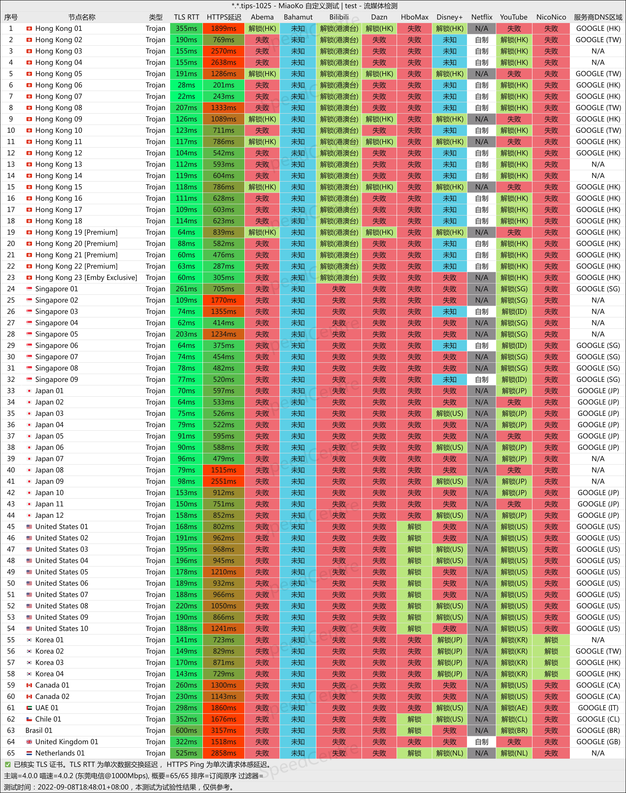

按轻度使用和重度使用分推荐。每种就推荐两三个，需要其他的可以参考毒药的帖子[👉链接](https://www.duyaoss.com/)。

极简总结：

- 🔥尝鲜偶用，预算较低：[一元机场，一个月不到1块钱](https://xn--4gq62f52gdss.club/#/register?code=QFTTlbYU)
- 🔥重度依赖，流媒解锁：[TAG 全球250+节点、99+流媒体解锁](https://tagss04.pro/#/auth/2neqgxFl)

## 轻度使用

- 预算低，舍不得在这方面大支出
- 备用机场防失联
- 海淘、谷歌
- 偶尔看看 Youtube 等视频
- Telegram 聊天
- 基本没有速度和时延要求

### [一元机场](https://xn--4gq62f52gdss.club/#/register?code=QFTTlbYU)🔥

官网：[👉链接🚀](https://xn--4gq62f52gdss.club/#/register?code=QFTTlbYU)

协议：`Trojan`

特点：廉价，流量高，速度还行，但是不太稳定。

有点小名气的低价机场，主打的就是一个价格低。晚高峰会有点卡，稳定性也不算高，不过 12CNY/Year、20CNY/2Year 的价格要什么自行车，主要是速度也还行，解锁 Netflix 和 Disney+，美国节点解锁 ChatGPT。

他家就买这个传家宝套餐就行了，当然其他套餐也可以，不过个人觉得意义不大。

节点以香港、日本、美国、新加坡为主，偶尔会出现土耳其等特别的节点。

### [三分机场](https://xn--ehq00hgtfdmt.xyz/#/register?code=FKnu6Hkg)

官网：[👉链接🚀](https://xn--ehq00hgtfdmt.xyz/#/register?code=FKnu6Hkg)

协议：`VMESS`

特点：廉价，流量较少，速度还行，稳定性一般，相对小众一点。

和上面类似，也是靠低价起家的，后来也推出了高级套餐，不过买贵的干嘛买他家。9.5CNY/Year 的价格，VIP1-200G 每月-年付套餐，大概每天 3 分钱，机场名字应该也是这么来的，买个随便玩玩还是可以的。

特别注意，套餐里有个小字说明，`福建福州、泉州、河南大部分地区此套餐可能无法使`，这些地区的小伙伴谨慎购买。

目前节点包括香港、日本、美国、新加坡、台湾。

官方频道测速如下：

额外提一下中转套餐，节点较少，由于近期刚推出，猜测应该会不错，价格实惠，14.50CNY/月付，流量300G/月，可以试试。没找到测速图，贴一张节点图给大家参考。

## 重度使用

- **不在乎价格**
- Netflix、Disney+ 等流媒体重度依赖
- 长期看不能直连的 Emby 公益服
- Telegram 上看视频
- 办公强依赖
- 追求稳定性
- 高速和低时延要求

### [TAG 全球250+节点、99+流媒体解锁](https://tagss04.pro/#/auth/2neqgxFl)🔥

官网：[👉链接🚀](https://tagss04.pro/#/auth/2neqgxFl)

协议：`Shadowsocks`

特点：比较贵，节点覆盖面广，速度较快，稳定。

以前的 Ac­cel­er­a­tor，线路现在是全 BGP-IEPL 广港 + BGP-IEPL 沪日中转，全球90+国家地区节点，地区覆盖范围目前应该是最广的。

同样的，Netflix、Disney+ 等流媒体，该解锁的都解锁了，ChatGPT 也是。

他家有一个特别套餐，154CNY/Year，总共200G流量，用作备用防失联特别好，或者需要一些罕见地区的时候。

其他套餐价格如下：

毒药的电信测速，可以参考下。

### [Nexitally](https://nexitally.net/)

官网1：[👉链接🚀](https://nexitally.net/)

官网2：[👉链接🚀](https://nexitallysafe.com/)

协议：`Shadowsocks`, `Trojan`

特点：昂贵，稳定，流量还行，速度快，晚高峰也稳定有速度。`PS: 最近稍微有点不稳定，不知道机场在折腾啥，建议稍微观望下。`

官网打不开的话先挂个别的代理。

[毒药](https://www.duyaoss.com/)推荐中的第一名，佩奇家中转线路的高端机场，成立大概三年多。稳定性和速度都不错，价格高，但是对于追求稳定性的用户也还好。

这也是我个人主要使用的，已经使用三年了，目前应该是第四年。

Netflix、Disney+ 等流媒体，该解锁的都解锁了，ChatGPT 也是可以正常用的。

有自己的傻瓜客户端，可以登录后一键连接。

套餐情况：

- Smart Access：每月 500G 流量，约 117CNY/Month，约 606CNY/Year，约 1102CNY/Year
- Smart Access Air：每月 200G 流量，价格是 Smart Access 的一半多点，但是`限量提供，能不能买到看缘分，买到后可以一直续费`

毒药的电信测速，可以参考下。

### [TLS](https://tls.wiki/index.php#/register?code=ojo2nVBG)

官网：[👉链接🚀](https://tls.wiki/index.php#/register?code=ojo2nVBG)

协议：`Shadowsocks`

特点：中高级套餐附带Emby，价格适中，速度较快，相对稳定。`PS: Emby 服务高清资源已经恢复了，4K还没有，感觉半摆烂了······`

最大的特色是高级套餐附带 Emby 服务，并且直连 Emby 的速度也是不错的，不需要梯子就能直接看。影视库更新速度也挺快，最新电视剧集基本第二天就上了。

套餐除了机场送 Emby 外，也单独提供了 Emby 套餐。

相对小众一点，客服态度也很好，价格与 Nexitally 和 TAG 相比要低一点。

测速如下：

## 最后

对于刚接触科学上网的朋友，建议先买廉价的梯子试试，确认自己是否有科学上网的需求、科学上网的依赖度有多大，然后再考虑换高价稳定的梯子。

对于海淘只看看商品不亲自购买的朋友，一元机场、三分机场这种完全够用，别信海淘群里那种倒卖的，说不定卖给你的也是这种。
