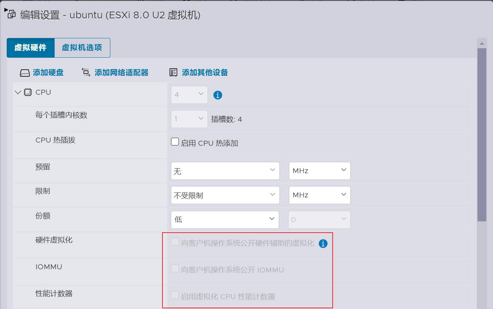
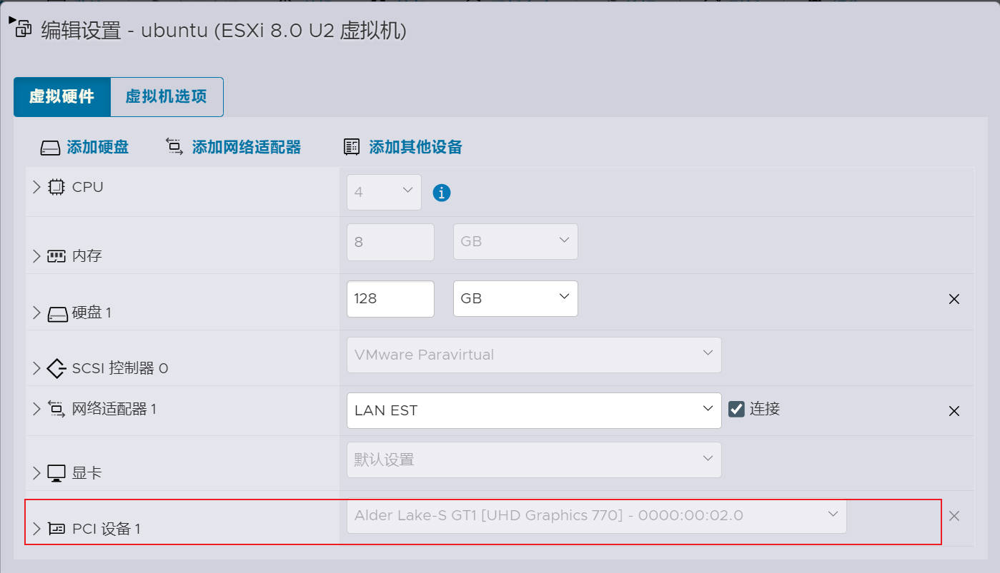
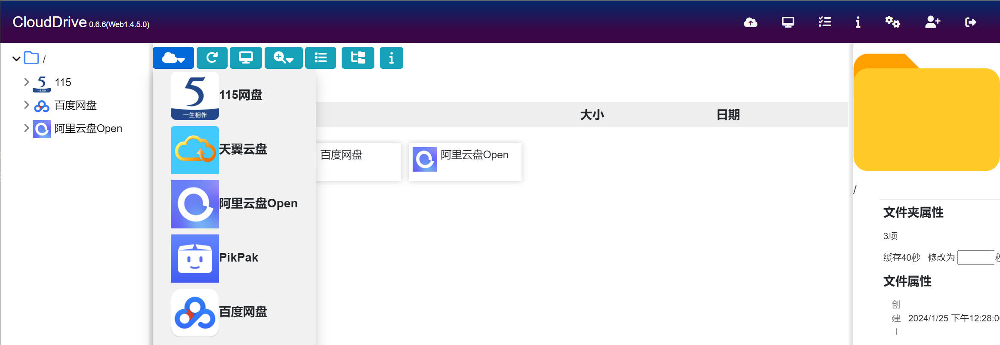
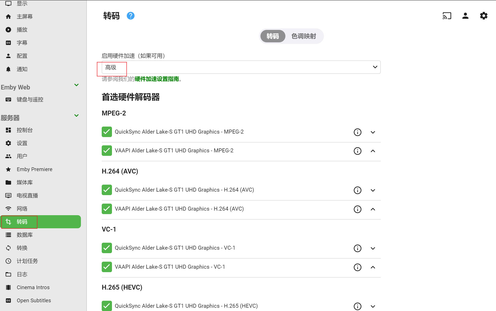

🔥🔥🔥：稳定好用的机场/梯子 [TAG 全球250+节点、99+流媒体解锁](https://tagss04.pro/#/auth/2neqgxFl)，更多参考[机场推荐](https://alecthw.github.io/p/2023/11/airport-recommend/)

---

👉 注册 CloudDrive2 的时候可以填上我的推荐码哦：`cAR6b415`。

核心点：

1. 使用 CloudDrive2 把云盘挂载到本地。
2. 新款 CPU 如果没有硬解选项，就安装 beta 版的 emby。

`PS：以下使用的ESXi 8.0，基于 Ubuntu 22.04 LTS，在 root 用户下操作。需要有简单的 Linux 基础知识，例如了解 SSH、VIM 怎么使用。`

`PS：CloudDrive2 和 Emby 的都是从 Github 下载的，连不上 Github 自行科学上网。`

## ESXi 核显直通

务必先创建好虚拟机，并配置好静态 IP 地址和 SSH！！！

直通并添加核显到虚拟机之后，ESXi网页中，虚拟机的控制台将什么也不显示了。如果没有配置 IP 和 SSH，只能要么把虚拟机核显删掉，要么机器直接连显示器。

### 1. 打开 ESXi SSH

如图所示操作。开启完使用工具登录，例如 Putty、XShell 等。


### 2. 禁用 ESXi 显卡调用

禁用后，机器连接显示器将不显示黄黑色控制台。

```bash
# 禁用
esxcli system settings kernel set -s vga -v FALSE

# 查看配置结果
esxcli system settings kernel list -o "vga"
```

查出的结果如下，`Configured` 显示 `FALSE` 即成功，等一会儿重启后 `Runtime` 会变成 `FALSE`。

```txt
Name  Type  Configured  Runtime  Default  Description
----  ----  ----------  -------  -------  -----------
vga   Bool  FALSE       TRUE     TRUE     Enable/Disable VGA support.
```

### 3. passthru.map 增加核显

查看核显设备ID

```bash
# 禁用
lspci -v | grep -A 2 VGA
```

返回的信息如下，关注下第二行。

```txt
0000:00:02.0 Display controller VGA compatible controller: Intel Corporation Alder Lake-S GT1 [UHD Graphics 770] 
	 Class 0300: 8086:5916
```

`8086` 是供应商 ID，这里就是 Intel，`5916` 就是硬件 ID。记下这8个字符，这里不要照抄哦，要用你自己的。

用 vi 修改 `passthru.map`，在最后添加

```txt
# Intel VGA
8086  5916  d3d0     default
```

保存，重启ESXi主机。

### 4. 切换显卡直通

ESXi Web 控制台下


切换成功后，直通显示为 `活动`。ESXi 7.x 和 ESXi 8.x 是不需要重启主机的，ESXi 6.7 可能还需要重启一次。

### 5. 虚拟机添加核显

创建虚拟机的步骤不再赘述。

编辑虚拟机

禁用 CPU 下虚拟化相关的三个配置



内存下，勾选 `预留所有客户机内存`


添加 PCI 设备


在 `PCI设备1`中，选择你的核显。



保存，启动虚拟机。这一次启动可能会比较慢，耐心等待，直到 SSH 可以连接上虚拟机。

## 安装配置 CloudDrive2

后续虚拟机上，都是在 `root` 用户下操作的。

### 1. 虚拟机前置配置

```bash
# 切换到 root 用户
sudo su

# 安装 vim
apt update
apt install -y vim

# 禁用防火墙
systemctl stop ufw
systemctl disable ufw
```

### 2. 安装

[CloudDrive2 官网](https://www.clouddrive2.com/download.html)下载 Linux 版本，使用 SFTP 客户端，上传到虚拟机的 `/opt` 目录下。

```bash
# 进入 /opt 目录
cd /opt

# 创建一个新目录，给后续挂载云盘用
mkdir /opt/mnt

# 解压
tar xzf clouddrive-2-linux-x86_64-*.tgz

# 更名
mv clouddrive-2-linux-x86_64-* clouddrive2
```

### 3. 创建 systemd service

```bash
vim /lib/systemd/system/clouddrive2.service
```

填入以下内容

```txt
[Unit]
Description=clouddrive2
ConditionFileIsExecutable=/opt/clouddrive2/clouddrive
After=network.target
Wants=network.target

[Service]
Type=simple
PIDFile=/var/run/clouddrive2.pid
ExecStart=/opt/clouddrive2/clouddrive
WorkingDirectory=/opt/clouddrive2
Restart=on-failure

[Install]
WantedBy=multi-user.target
```

### 4. 启动 CloudDrive2

```bash
systemctl enable clouddrive2
systemctl start clouddrive2
```

### 5. 网页登陆配置

http://ip:19798/

注册登录后界面如下



点击云图标添加网盘，登录授权。

CloudDrive2 免费版功能有限制，一般情况下个人用户足够使用。具体可参考下图：


### 6. 挂载网盘到本地

左树选择一个网盘（也可以选择子目录），然后点击 `电脑`图标，开始挂载，界面如下


如果默认的名称为中文，建议改成 `英文/数字`，这个名称就是挂载后，Linux 本地的文件夹名称。

点击 `选择`，选择挂载点，这里选择之前创建的 `/opt/mnt` 目录


挂载成功后，命令行看一下虚拟机的目录，这里我挂载了 aliyun 和 115。

```bash
root@ubuntu-emby:~# ls /opt/mnt/
115  aliyun
```

## 安装配置 Emby-Server

注意：较新的CPU，建议下载 Beta 版本，否则硬解无法选择 `QuickSync`。或者先安装标准版，发现硬解无法选择 `QuickSync`，再覆盖安装 Beta 版。

### 1. 安装

[Emby 官网下载](https://emby.media/linux-server.html) ubuntu 版本的 deb 包。

安装

```bash
dpkg -i emby-server-deb_*_amd64.deb
```

安装后已经自动启用了，可以再执行一遍以下命令，防止开机自启没开启。

```bash
systemctl enable emby-server
```

查看运行状态

```bash
systemctl status emby-server
```

### 2. 启动顺序

由于使用了 CloudDrive2 挂载云盘，期望的是 CloudDrive2 要在 Emby 之前启动，才能保证 Emby 正常读取到网盘内容，避免报错。

编辑 emby 的 service 文件

```bash
vim /lib/systemd/system/emby-server.service
```

在 `After=network.target` 后面，均添加 `clouddrive2.service`，然后再添加一行 `Wants=network.target clouddrive2.service`，如下

```txt
[Unit]
Description=Emby Server is a personal media server with apps on just about every device
After=network.target clouddrive2.service
Wants=network.target clouddrive2.service
·····
```

重载并重启

```bash
systemctl daemon-reload
systemctl restart emby-server
```

注意，升级安装 emby 后，这个 service 会被覆盖成默认的，需要再次修改。

### 3. 配置 Emby

http://ip:8096/

登录后按照指引配置就行了，这里网上教程很多，不赘述。

创建媒体库的时候，文件夹选择通过 CloudDrive2 挂载到本地的文件夹即可。例如：


### 4. Emby 硬解

如下图，勾选 `QuickSync`，调整顺序即可。



然后，随便找个视频测试下转码，调整码率，拖拉快进等。

### 5. 电视直播 m3u

目前好用的直播源都是 ipv6 的，如果正确配置了 ipv6，可以添加如下直播源和指南数据库。

- 直播源：https://live.fanmingming.com/tv/m3u/ipv6.m3u
- XmlTV：https://live.fanmingming.com/e.xml
