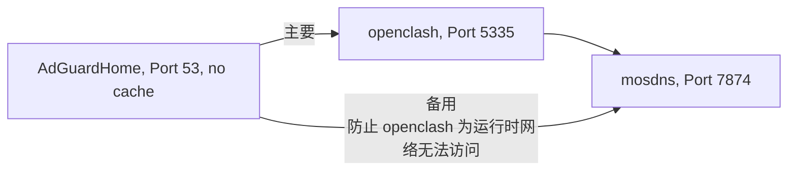
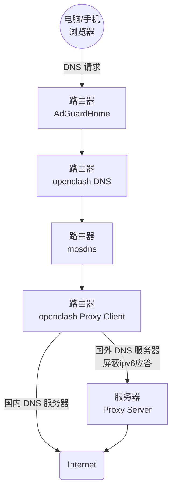
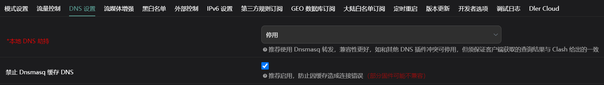
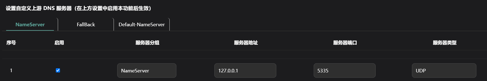

🔥🔥🔥：稳定好用的机场/梯子 [TAG 全球250+节点、99+流媒体解锁](https://tagss04.pro/#/auth/2neqgxFl)，更多参考[机场推荐](https://alecthw.github.io/p/2023/11/airport-recommend/)

---

👉 首先推广下自己编译的 OpenWrt 旁路由极简版，专为旁路由而制作。 👍👍👍

- 编译脚本以及个人修改的组件依赖全开源，Github Actions 在线编译，安全可靠无后门。
- 基于 [lede](https://github.com/coolsnowwolf/lede) 源码
- 默认配置 DHCPv6 Client 接口 lan6。
- 默认配置好了 AdGuardHome 、 mosdns 和 openclash （或 ssrp ）的搭配运行配置。
- openclash 预置 clash_meta 内核。
- mosdns 使用了 [自己的修改版](https://github.com/alecthw/mosdns)，支持 MMDB GeoIP 匹配。

| 版本 | 说明 | 下载地址 |
|---|---|:---:|
| x86 | 包含 ssrp 和 openclash，[详细说明](https://github.com/alecthw/openwrt-actions/blob/master/user/lede-common-x86-amd64/README.md) | [下载](https://github.com/alecthw/openwrt-actions/releases/tag/lede-common-x86-amd64) |
| x86 openclash 专版 | 仅包含 openclash，[详细说明](https://github.com/alecthw/openwrt-actions/blob/master/user/lede-openclash-x86-amd64/README.md) | [下载](https://github.com/alecthw/openwrt-actions/releases/tag/lede-openclash-x86-amd64) |
| r2s | 包含 ssrp 和 openclash，[详细说明](https://github.com/alecthw/openwrt-actions/blob/master/user/lede-common-r2s-arm64/README.md) | [下载](https://github.com/alecthw/openwrt-actions/releases/tag/lede-common-r2s-arm64) |
| n1 | 包含 ssrp 和 openclash，[详细说明](https://github.com/alecthw/openwrt-actions/blob/master/user/lede-common-n1-arm64/README.md) | [下载](https://github.com/alecthw/openwrt-actions/releases/tag/lede-common-n1-arm64) |

## 前言

CN网络的阻断方式主要有两个部分：

- GFW 阻断
- DNS 污染

GFW 阻断就是我们常说的`被墙了`，即使是DNS没有被污染，也无法访问到。

DNS 污染即让你访问网站时，无法获得域名对应的IP地址，从而导致无法访问到网站。DNS 污染在移动宽带中尤为典型，即使自定义了DNS 服务器，也会被拦截污染。

要实现科学上网，必须同时解决`GFW 阻断`和`DNS 污染`，并且两者配合以提高网络访问体验。

代理中的DNS知识，可以参考 Sukka 的这篇文章[《浅谈在代理环境中的 DNS 解析行为》](https://blog.skk.moe/post/what-happend-to-dns-in-proxy/)

### 路由器科学上网和终端科学上网的区别

路由器上配置透明代理，和在终端PC上直接通过客户端，最主要的区别是 DNS 解析。

#### PC终端上

通常有以下几个步骤

1. 启动客户端
2. 选择全局/规则模式
3. 配置系统代理（一般客户端自动配置），把科学上网客户端作为系统代理的上游代理服务器

第3步里的配置系统代理，通常有`http`和`sock5`两种。

此时，打开浏览器访问一个网站：

当使用`http`代理时，浏览器不会在本地进行 DNS 解析，请求的域名会作为 http 报文的一部分直接发给代理服务器（科学上网客户端），DNS 完全在代理服务器（科学上网客户端）上处理。

当使用`sock5`代理时，`sock5`支持UDP，DNS 解析会封装在`sock5`之中，发给代理服务器（科学上网客户端）处理，浏览器拿到 IP 地址后，在发起连接。

#### 路由器上配置透明代理

此时，科学上网客户端运行在路由器上，PC 终端是看不见代理的，所以叫透明代理。PC 终端上，请求的发起的流程照旧，先进行 DNS 解析，拿到 IP 后再发起请求。

在这种情况下，对于路由器上运行的科学上网客户端来说，域名和 IP 是两个请求，有的会内置 Mapping 机制（例如 Clash），用来还原 IP 到域名。

这种情况下，优惠DNS配置就相对比较重要了，否则针对部署的CDN的网站不能做到最优访问。

## 正文开始：配置 & DNS 优化

本文主要考虑的是自由的局域网环境，所以只介绍路由器上科学上网配置。

首先分析下要实现的目标：

- 双栈网络
  - 国内网络使用 IPV4 & IPV6 双栈
  - 科学上网仅使用 IPV4
- 国内外分流
- DNS分流
  - 国内域名由国内 DNS 服务器解析
  - 国外域名经过代理由国外 DNS 服务器

### 国内外和应用分流

这个没啥好多说的，按文档配置规则就行。也可参考文末给出的示例配置。

### DNS 优化目标

- 广告过滤：使用 AdGuardHome
- DNS分流：使用 mosdns
  - 其中，境外网站屏蔽 IPV6 应答
- 如果使用 openclash，DNS 必须经过 clash 内核，以使 DNS 完成 IP <--> Domain 的 mapping

PS: mosdns 使用[ alecthw 修改版](https://github.com/alecthw/mosdns)，支持 MMDB GeoIP 匹配

### 多级 DNS 级联



配置过程如下：
- 修改了 dnsmasq 的默认端口号，用 AdGuardHome 监听53端口作为默认的DNS解析。
- AdGuardHome 可以监控的各个终端的 DNS 请求，并使用广告过滤和管控功能。
- openclash 作为 AdGuardHome 的上游。
- mosdns 作为 AdGuardHome 的上游备用服务器。
- openclash 中`本地 DNS 劫持`设置为`停用`，当 openclash 运行时，openclash 作为 AdGuardHome 的上游主要服务器`生效`。
- openclash 复写设置中，启用自定义上游 DNS 服务器，并指定 mosdns 为唯一上游。

如此一来，最终的 DNS 请求由 mosdns 发出，请求会经过 openclash 分流，按请求的 DNS 服务器直连或走代理。DNS 请求整个流程如下：



如此，便实现了

- AdGuardHome 的管控和广告过滤
- mosdns 分流 DNS，并屏蔽非中国大陆 IP 的 IPV6 应答
- DNS 经过 clash 内核，迎合其 mapping 机制

### 配置示例

再次提醒，文章开始处的固件，所有配置已内置哦！

#### dnsmasq


#### AdGuardHome


#### openclash





注意删除默认的DNS配置，仅保留这一个即可。

#### mosdns

使用自定义配置，由于使用了 mmdb geoip 匹配，mosdns 必须使用[ alecthw 修改版](https://github.com/alecthw/mosdns)。

PS: 以下配置中的[cn-white.txt](https://github.com/alecthw/chnlist/blob/release/mosdns/whitelist.list)，来自项目[chnlist](https://github.com/alecthw/chnlist)，我编译的固件已内置并设置自动更新，其他固件需要手动下载。

```yaml
# 白名单模式
# 白名单 或 境外查询IP是geoip:CN，走国内

log:
  level: info
  file: "/tmp/mosdns.log"

plugins:
  # mmdb
  - tag: country
    type: mmdb
    args:
      file: "/etc/mosdns/rule/Country.mmdb"

  # cn ip
  - tag: whitelist
    type: domain_set
    args:
      files:
        - "/etc/mosdns/rule/cn-white.txt"

  # 广告域名列表 geosite:category-ads-all
  - tag: geosite_ads
    type: domain_set
    args:
      files:
        - "/etc/mosdns/rule/reject-list.txt"

  # hosts
  - tag: hosts
    type: hosts
    args:
      entries:
        - "localhost 127.0.0.1"

  # 缓存
  - tag: cache
    type: cache
    args:
      size: 20480
      lazy_cache_ttl: 86400
      dump_file: "/etc/mosdns/cache.dump"
      dump_interval: 1800

  # 查询境外DNS
  - tag: forward_global
    type: forward
    args:
      concurrent: 3
      upstreams:
        - tag: Google_dot
          addr: "tls://8.8.4.4"
          enable_pipeline: true
        - tag: Quad9_dot
          addr: "tls://9.9.9.9"
          enable_pipeline: true
        - tag: Cloudflare_dot
          addr: "tls://1.0.0.1"
          enable_pipeline: true
        - tag: OpenDNS_dot
          addr: "tls://208.67.222.222"
          enable_pipeline: true

  # 查询国内DNS
  - tag: forward_china
    type: forward
    args:
      concurrent: 2
      upstreams:
        - tag: Ali_dot
          addr: "tls://223.5.5.5"
          enable_pipeline: true
        - tag: DNSPod_dot
          addr: "tls://120.53.53.53"
          enable_pipeline: true

  # 境外解析，优先IPV4
  - tag: global_sequence
    type: sequence
    args:
      - matches: qname $whitelist
        exec: return
      - exec: prefer_ipv4
      - exec: $forward_global
      - matches: resp_ip_mmdb $country CN
        exec: drop_resp

  # 国内解析，不设置过滤，作为fallback
  - tag: china_sequence
    type: sequence
    args:
      - exec: $forward_china

  # 屏蔽解析
  - tag: reject_sequence
    type: sequence
    args:
      - matches: qname $geosite_ads
        exec: reject 3
      - matches: qtype 12
        exec: reject 3
      # - matches: qtype 65
      #   exec: reject 3

  # 如果 primary 抛出错误，或返回但没有应答，或在 threshold 毫秒内无响应，则执行 secondary。
  # 所以在 primary 中不能用 rejcet，reject 也是应答
  # Fallback
  - tag: fallback
    type: fallback
    args:
      primary: global_sequence
      secondary: china_sequence
      threshold: 150
      always_standby: true

  - tag: main_sequence
    type: sequence
    args:
      - exec: $reject_sequence

      - exec: $hosts
      - matches: has_resp
        exec: accept

      - exec: $cache
      - matches: has_resp
        exec: accept

      - exec: $fallback
      - matches: has_resp
        exec: ttl 10-600

  - tag: udp_server
    type: udp_server
    args:
      entry: main_sequence
      listen: 0.0.0.0:5335
```
