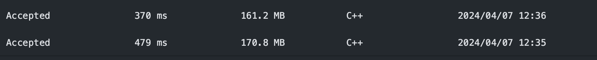

## 题目描述

一个王国里住着国王、他的孩子们、他的孙子们等等。每一个时间点，这个家庭里有人出生也有人死亡。

这个王国有一个明确规定的王位继承顺序，第一继承人总是国王自己。我们定义递归函数 Successor(x, curOrder) ，给定一个人 x 和当前的继承顺序，该函数返回 x 的下一继承人。

Successor(x, curOrder):
    如果 x 没有孩子或者所有 x 的孩子都在 curOrder 中：
        如果 x 是国王，那么返回 null
        否则，返回 Successor(x 的父亲, curOrder)
    否则，返回 x 不在 curOrder 中最年长的孩子
比方说，假设王国由国王，他的孩子 Alice 和 Bob （Alice 比 Bob 年长）和 Alice 的孩子 Jack 组成。

一开始， curOrder 为 ["king"].
调用 Successor(king, curOrder) ，返回 Alice ，所以我们将 Alice 放入 curOrder 中，得到 ["king", "Alice"] 。
调用 Successor(Alice, curOrder) ，返回 Jack ，所以我们将 Jack 放入 curOrder 中，得到 ["king", "Alice", "Jack"] 。
调用 Successor(Jack, curOrder) ，返回 Bob ，所以我们将 Bob 放入 curOrder 中，得到 ["king", "Alice", "Jack", "Bob"] 。
调用 Successor(Bob, curOrder) ，返回 null 。最终得到继承顺序为 ["king", "Alice", "Jack", "Bob"] 。
通过以上的函数，我们总是能得到一个唯一的继承顺序。

请你实现 ThroneInheritance 类：

ThroneInheritance(string kingName) 初始化一个 ThroneInheritance 类的对象。国王的名字作为构造函数的参数传入。
void birth(string parentName, string childName) 表示 parentName 新拥有了一个名为 childName 的孩子。
void death(string name) 表示名为 name 的人死亡。一个人的死亡不会影响 Successor 函数，也不会影响当前的继承顺序。你可以只将这个人标记为死亡状态。
string[] getInheritanceOrder() 返回 除去 死亡人员的当前继承顺序列表。

## 思路

### DFS

思路很简单，就是用一个map记录每个人的后代，有点像邻接表，然后dfs遍历就可以得到继承顺序，还有注意不要把死人加进顺序，可以用一个set记录哪些人死了。

## 启发

这道题不难，但是我学到了一些很实用的知识，主要是c++的知识。

我的代码：

```c++
class ThroneInheritance {
public:
    unordered_map<string, vector<string>> family;
    unordered_set<string> dead;
    string kingName;
  
    ThroneInheritance(string kingName) {
        this->kingName = kingName;
        family[kingName] = {};
    }
  
    void birth(string parentName, string childName) {
        family[parentName].push_back(childName);
    }
  
    void death(string name) {
        dead.insert(name);
    }
  
    vector<string> getInheritanceOrder() {
        vector<string> order;
        successor(this->kingName,order);
        return order;
    }
  
    void successor(string name,vector<string>& order){
        if(!isDead(name)){
            order.push_back(name);
        }
        for(auto c:family[name]){
            successor(c, order);
        }
    }
  
    bool isDead(string name){
        auto it = dead.find(name);
        return it != dead.end();
    }
};
```

别人的代码：

```c++
class ThroneInheritance {
private:
    unordered_map<string, vector<string>> edges;
    unordered_set<string> dead;
    string king;

public:
    ThroneInheritance(string kingName): king{move(kingName)} {}

    void birth(string parentName, string childName) {
        edges[move(parentName)].push_back(move(childName));
    }

    void death(string name) {
        dead.insert(move(name));
    }

    vector<string> getInheritanceOrder() {
        vector<string> ans;

        function<void(const string&)> preorder = [&](const string& name) {
            if (!dead.count(name)) {
                ans.push_back(name);
            }
            if (edges.count(name)) {
                for (const string& childName: edges[name]) {
                    preorder(childName);
                }
            }
        };

        preorder(king);
        return ans;
    }
};

```

两个 `ThroneInheritance`类的实现在功能上是等价的：它们都使用深度优先搜索（DFS）来遍历家族树，生成继承顺序的列表，同时考虑已经去世的成员。主要的区别在于类成员的初始化、数据结构的操作以及递归函数的定义和调用方式。尽管这些区别对于功能实现来说是微不足道的，它们可能会影响到代码的运行时性能和内存使用，具体如下：

### **成员变量初始化**：

- 第一个实现中使用 `move`语义直接初始化 `king`变量和在 `birth`、`death`方法中使用 `move`语义插入元素，这可以减少字符串的复制次数，从而可能稍微减少内存使用和提高性能。
- 第二个实现中对于 `kingName`的初始化使用的是直接赋值，这可能涉及到字符串的复制。

### **递归函数定义**：

- 第一个实现中使用了lambda表达式定义了递归函数，这种方法可能会让编译器更容易进行优化，特别是在内联函数调用方面。
- 第二个实现中，递归函数 `successor`作为类的成员函数实现，这意味着每次调用都需要传递 `this`指针，增加了调用的开销。

### **数据结构操作**：

- 在两个实现中，数据结构的操作方式基本一致，但是在如何访问和修改 `family`或 `edges`和 `dead`时，细节上的处理（如是否使用 `move`语义）可能会导致实际性能的微小差异。

### **map和set**

- 第一个实现中在递归时，我发现我没进行判断有没有后代：

```c++
if (family.count(name))
```

我以为就算没有后代，接下来的for循环会直接结束的吧，看来实际情况和我想的不一样，如果 `family`映射中没有给定名称 `name`的条目，那么 `family[name]`将返回一个新的、空的 `vector<string>`实例。在这种情况下，紧随其后的 `for`循环应该会立即结束，因为它迭代的是一个空容器。

```cpp
for(const string&  c:family[name]){
    successor(c);
}
```

如果 `name`没有对应的后代（即 `family`中没有 `name`的键），按照上面的代码逻辑，`family[name]`将创建一个新的空 `vector`，并立即返回。这意味着循环确实应该直接结束，不执行任何迭代。

然而，调用 `family[name]`时有一个副作用：如果 `family`中不存在键 `name`，这个操作会在 `family`中插入一个新的键值对，键是 `name`，值是一个空的 `vector<string>`。这是 `std::unordered_map`的标准行为，即使用下标操作符 `[]`访问映射时，如果键不存在，会自动创建它。

这个副作用意味着即使对于没有后代的成员，`family`映射的大小也可能增加。
正是这个副作用导致我的代码运行内存比第二个实现要高。



这不会影响 `for`循环的执行（因为新插入的向量是空的)，但确实会改变 `family`映射的状态，这可能不是你想要的结果，特别是在考虑内存使用和性能的时候。因为每次调用 `getInheritanceOrder`时，对于没有后代的成员也会增加新条目，这可能会导致 `family`的大小不必要地增加。

因此，加上 `if (family.count(name))`这样的判断是有意义的，它可以避免不必要地向 `family`中添加新的空向量，尤其是在不需要为没有后代的成员记录空向量的情况下。这个判断确保了只有当 `name`实际上有后代时，才会执行对应的递归调用，这样可以优化性能和内存使用，避免不必要的映射扩展。

总结来说，即使在没有明确后代的情况下 `for`循环本身会直接结束，检查 `family.count(name)`可以避免因为访问不存在的键而导致的 `unordered_map`不必要的修改和潜在性能影响。
