🔥🔥🔥：稳定好用的机场/梯子 [TAG 全球250+节点、99+流媒体解锁](https://tagss04.pro/#/auth/2neqgxFl)，更多参考[机场推荐](https://alecthw.github.io/p/2023/11/airport-recommend/)

---

## 前言

当前 V2Ray 应该算是比较好用的翻墙软件，和 ss、ssr 相比还是很稳定的，不容易被检测，尤其是加上 Nginx 和 TLS，再做个简单的网站顶在前面，完全伪造成了一个正常的网页访问行为，非常安全可靠，并且具有很强的抗检测能力。

- **_必须会简单使用 Linux 命令行，即 Shell_**
- **_以下示例中的域名均为`www.example.cc`，域名、UUID 以及 MTProto 的密钥请记得替换成自己的_**
- 有耐心、喜欢折腾或者想自己学点东西的就往下看
- 没耐心的可以去用机场或者一键脚本
- 这是针对学生和工薪阶层且有科学上网需求的同志，土豪请直接用机场去吧（比如[外号 richCloud 的 rixCloud](https://rixcloud.me/)）

### 参考文档

[V2Ray 官方文档](https://www.v2ray.com/)
[V2Ray 白话文教程](https://toutyrater.github.io/)
[MTProxy 官方文档](https://github.com/TelegramMessenger/MTProxy)

### 涉及的内容

```mermaid
graph LR
  subgraph V2Ray
    v2rayws[V2Ray WebSocket]
    v2raytg[V2Ray MTProto]
  end
  free((WAN))
  rep(外部请求) --> in[Nginx]
  in -- / --> web[腾讯公益404]
  in -- /wss --> v2rayws
  v2rayws --> free
  tgc(Telegram Client) --> v2raytg
  v2raytg --> free
```



1. 域名申请；
2. Let's Encrypt 申请 SSL 证书；
3. Nginx 作为前置服务配置 web 主页；
4. 通过配置 Nginx 反向代理访问后面的 v2ray 服务；
5. v2ray 同时提供 mtproto 服务；
6. 使用腾讯公益 404 作为 web 主页；

### 大致的步骤

1. 准备服务器；
2. 申请域名；
3. 创建网站根目录；
4. 安装 Nginx；
5. 获得 SSL 证书；
6. 修改 Nginx 配置支持 Https；
7. 安装启动 V2Ray；

## 安装部署

### 端口规划

| Port  | Listen IP | Use             |
| ----- | --------- | --------------- |
| 80    | 0.0.0.0   | Nginx Http      |
| 443   | 0.0.0.0   | Nginx Https     |
| 10443 | 127.0.0.1 | V2Ray WebSocket |
| 8080  | 0.0.0.0   | V2Ray MTProto   |

### 服务器准备

拿来翻墙用的服务器，肯定是本着便宜好用性价比高的原则来选择。[搬瓦工](https://bwh8.net/)毕竟有 cn2 和 cn2 gia 线路，价格也算是最便宜的，重点可以支付宝支付，还是选择搬瓦工吧。

逢年过节，搬瓦工都会推出特别款优惠主机，比如双十一、黑五，性价比极高！可以关注下。

#### BandwagonHost 套餐选择

搬瓦工套餐很多，相同配置不同价格排序如下：
`普通线路 < CN2线路 < CN2 GIA线路`
一般情况下个人使用或者家用的话，最便宜的套餐足以，不常看视频，一个月流量在 100-200GB。

注册购买什么的就不赘述了，现在上过学都看得懂英文。

根据自己的需求选择相应的配置即可，避免浪费。

- 访问谷歌，简单的网页访问需求

```text
10G VZ - PROMO
SSD: 10 GB RAID-10
RAM: 512 MB
CPU: 1x Intel Xeon
Transfer: 500 GB/mo
Link speed: 1 Gigabit
```

19.99 美刀一年，只能年付。
OpenVZ 架构，唯一的优势就是便宜。高峰期对主机性能和网络都有影响。

- 偶尔看看视频，比如油管

```text
SPECIAL 10G KVM PROMO V3 - LOS ANGELES - CN2
SSD: 10 GB RAID-10
RAM: 512 MB
CPU: 1x Intel Xeon
Transfer: 500 GB/mo
Link speed: 1 Gigabit
```

29.99 美刀一年，只能年付。**_一般人建议买这个_**。
KVM 架构，延迟勉强，`170ms`左右，油管 4K 撑得住。高峰期对网络有一定影响。

- 强烈视频需求，打游戏，需要低延迟网络

```text
SPECIAL 10G KVM PROMO V3 - LOS ANGELES - CN2 GIA - LIMITED EDITION
**Limited stock available**
SSD: 10 GB RAID-10
RAM: 512 MB
CPU: 1x Intel Xeon
Transfer: 300 GB/mo
Link speed: 1 Gigabit
```

39.99 美刀一年，只能年付。此套餐经常缺货，想买的需要关注，有钱可以买上一级套餐（可季付、半年付、年付）。

同样 KVM 架构，延迟比 cn2 略低，油管 4K 撑得住。高峰期对网络影响较小。

#### 准备软件

1、 [MobaXterm](https://mobaxterm.mobatek.net/): SSH 客户端工具，集成了 SFTP，安装免费版即可
2、 [Visual Studio Code](https://code.visualstudio.com/): 编辑器，主要拿来编辑 Nginx 的配置文件和 V2ray 的配置文件，支持 JSON 代码高亮，避免配置文件编写错误

#### 配置服务器

这里以搬瓦工为例。

##### 更换操作系统

建议选择 CentOS7 吧，方便好用。如果是 KVM 架构的机器，还能选择支持 bbr 的操作 CentOS。这里以 CN2 GIA 的服务器为例。

**_以下命令均以 CentOS7 下的命令为例_**

- 登录搬瓦工`Client Area`，点`Services -> My Services`查看自己的所有服务
- 点击对应`Product/Service`后面的`KiwiVM Control Panel`按钮进入控制台
  
- 首先将虚拟机关机，关机后才能重装系统
  
- 选择`Install new OS`，然后选择`"centos-7-x86_64-bbr"`，勾选`"I agree ..."`，点`Reload`重新安装
  
- **_记下 root 密码和端口号备用_**

##### 更改服务器密码

使用 MobaXterm（或者其他 SSH 工具），使用刚刚的密码和端口号登录服务器，注意下**端口号**，搬瓦工的 SSH 不是默认 22 端口。
登录后执行`passwd`，然后输入两遍新密码即可

```bash
$ passwd
Changing password for user root.
New password:
Retype new password:
passwd: all authentication tokens updated successfully.
```

##### 更新系统

搬瓦工自带的 epel 总觉得缺包，所以卸载重新安装下。
同时需要安装下 vim、git、zip 和 unzip。

```bash
yum remove -y epel-release
yum install -y epel-release
yum update -y
yum install -y vim git zip unzip
```

#### 申请域名

由于要使用 TLS，所以需要一个域名。建议注册`.cc`结尾的域名，便宜并且不需要实名认证。
传送门：[https://wanwang.aliyun.com/](https://wanwang.aliyun.com/)

**_假设我们申请的域名的是：`example.cc`，编写配置文件时记得替换成自己的。_**

##### 配置域名解析

域名解析这里配置两条，把`example.cc`和`www.example.cc`都指向服务器的地址。


配置好之后，可以在本地 ping 一下，看看通没通。

```bash
ping example.cc
```

#### 准备 web 根目录

- 新建目录

  ```bash
  mkdir -p /www/root
  ```

- 增加`index.html`

  ```bash
  vim /www/root/index.html
  ```

  按下`i`键到插入模式后，将以下所有内容贴进去。

  ```html
  <!DOCTYPE html>
  <html>
    <head>
      <title>404</title>
      <meta http-equiv="Content-Type" content="text/html" charset="UTF-8" />
      <script
        type="text/javascript"
        src="//qzonestyle.gtimg.cn/qzone/hybrid/app/404/search_children.js"
        charset="utf-8"
        homePageUrl="https://www.example.cc/"
        homePageName="回到我的主页"
      ></script>
    </head>
  </html>
  ```

#### 安装配置 Nginx

Nginx 安装后，会用到两份配置：

- 第一份是给第一次申请 Let's Encrypt 的 SSL 证书用的（由于此时还没有证书，配置成 Https）
- 第二份是增加了 V2Ray 反代和 Http 重定向 Https 的配置，这个就是一直要用的配置

##### 安装 Nginx

很简单，一行命令搞定。

```bash
yum install -y nginx
```

##### 编辑`nginx.conf`

文件`/etc/nginx/nginx.conf`。
害怕出错的或者新手请将文件 SFTP 下载到本地，使用 VSCode 修改后再 SFTP 传回服务器。
熟悉 vim 的就直接在命令行修改吧。

配置文件如下：

```nginx
user nginx;
worker_processes auto;
error_log /dev/null;
pid /run/nginx.pid;

include /usr/share/nginx/modules/*.conf;

events {
    worker_connections 1024;
}

http {
    log_format  main  '$remote_addr - $remote_user [$time_local] "$request" '
                      '$status $body_bytes_sent "$http_referer" '
                      '"$http_user_agent" "$http_x_forwarded_for"';

    access_log  off;

    sendfile            on;
    tcp_nopush          on;
    tcp_nodelay         on;
    keepalive_timeout   65;
    types_hash_max_size 2048;

    include             /etc/nginx/mime.types;
    default_type        application/octet-stream;

    include /etc/nginx/conf.d/*.conf;

    server {
        listen       80 default_server;
        listen       [::]:80 default_server;
        server_name  example.cc www.example.cc;
        root         /www/root;
        index        index.html index.htm;

        location / {
        }
    }
}
```

##### 启动 Nginx 服务

```bash
systemctl enable nginx
systemctl start nginx
```

然后查看下运行状态是否已经正常启动，看到`running`即是正常。

```bash
$ systemctl status nginx
● nginx.service - The nginx HTTP and reverse proxy server
   Loaded: loaded (/usr/lib/systemd/system/nginx.service; enabled; vendor preset: disabled)
   Active: active (running) since Wed 2018-11-14 11:22:53 CST; 4 days ago
```

然后打开浏览器访问**www.example.cc**和**example.cc**看是否能打开腾讯公益 404 页面。能打开说明 Nginx 已经正确配置，然后就可以开始申请 SSL 证书了。

#### 安装 V2Ray

具体参考[V2Ray 官方文档](https://www.v2ray.com/chapter_00/install.html#linuxscript)：

```bash
bash <(curl -L -s https://install.direct/go.sh)
```

安装完成后自动启动，这里先把它给停了

```bash
systemctl stop v2ray
```

#### 申请 Let's Encrypt 的 SSL 证书

Let's Encrypt 有很多 ACME 客户端的实现。这里选用[acme.sh](https://github.com/Neilpang/acme.sh/wiki/%E8%AF%B4%E6%98%8E)。

##### 安装 acme.sh

安装很简单，一个命令：

```bash
curl  https://get.acme.sh | sh
```

安装完成后执行下

```bash
source /root/.bashrc
```

##### 申请证书

很简单，一也是命令：

```bash
acme.sh --issue -d example.cc -d www.example.cc --webroot /www/root/ -k ec-256
```

使用 ec-256 证书，让通信更安全吧。

##### 将证书安装到目录

这里将证书放到`/etx/v2ray`目录下。

```bash
acme.sh --installcert -d example.cc -d www.example.cc --key-file /etc/v2ray/v2ray.key --fullchain-file /etc/v2ray/v2ray.crt --ecc --reloadcmd  "service nginx force-reload && systemctl restart v2ray"
```

这行命令除了将证书放到指定目录下外，还会自动创建 crontab 定时任务，后面引号里的命令是定时任务更新证书后执行的命令。

#### 配置 Nginx 支持 Https 访问

不废话了，直接修改`/etc/nginx/nginx.conf`，完整配置文件如下：

```nginx
user nginx;
worker_processes auto;
error_log /dev/null;
pid /run/nginx.pid;

include /usr/share/nginx/modules/*.conf;

events {
    worker_connections 1024;
}

http {
    log_format  main  '$remote_addr - $remote_user [$time_local] "$request" '
                      '$status $body_bytes_sent "$http_referer" '
                      '"$http_user_agent" "$http_x_forwarded_for"';

    access_log  off;

    server_tokens       off;
    sendfile            on;
    tcp_nopush          on;
    tcp_nodelay         on;
    keepalive_timeout   65;
    types_hash_max_size 2048;

    include             /etc/nginx/mime.types;
    default_type        application/octet-stream;

    include /etc/nginx/conf.d/*.conf;

    # Http Server，强制跳转Https
    server {
        listen       80 default_server;
        listen       [::]:80 default_server;
        server_name  example.cc www.example.cc;
        rewrite      ^(.*)$ https://www.example.cc$1 permanent;
    }

    # Https Server
    server {
        listen       443 ssl http2 default_server;
        listen       [::]:443 ssl http2 default_server;
        server_name  www.example.cc;
        root         /www/root;
        index        index.html index.htm;

        ssl_certificate "/etc/v2ray/v2ray.crt";
        ssl_certificate_key "/etc/v2ray/v2ray.key";
        ssl_session_cache shared:SSL:1m;
        ssl_session_timeout  10m;
        ssl_ciphers HIGH:!aNULL:!MD5;
        ssl_prefer_server_ciphers on;

        include /etc/nginx/default.d/*.conf;

        location / {
        }

        # 反向代理V2Ray
        location /wss {
            proxy_redirect off;
            proxy_pass http://127.0.0.1:10443;
            proxy_http_version 1.1;
            proxy_set_header Upgrade $http_upgrade;
            proxy_set_header Connection "upgrade";
            proxy_set_header Host $http_host;
        }

        error_page 404 /404.html;
        location = /40x.html {
        }

        error_page 500 502 503 504 /50x.html;
            location = /50x.html {
        }
    }
}
```

配置完之后重新启动 Nginx

```bash
systemctl restart nginx
```

访问**www.example.cc**和**example.cc**，如果自动跳转`https://www.example.cc`并且正确显示公益 404 则已经配置正确。

#### 配置 V2Ray 并启动

前置的所有服务都已经配置完毕，只差最后的 V2Ray 了。

##### 为 V2Ray 生成一个 UUID

使用 V2Ray 自带的`v2ctl`工具生成一个新的 uuid。

```bash
$ /usr/bin/v2ray/v2ctl uuid
27e0efcc-8e13-fef1-9e82-febebc469b2b
```

记录下此 uuid

##### 为 mtproto 生成一个密钥

使用 linux 系统创建伪随机数作为密钥。

```bash
$ head -c 16 /dev/urandom | xxd -ps
80e2e037610bac1444ac02979364f666
```

记录下此随机数

##### 修改`/etc/v2ray/config.json`

同样的，没把握用 vim 修改的，就拷贝下来在 VSCode 里修改，改完再传回服务器。

将刚生成的 uuid 和随机数填入对应的位置。

完整配置文件如下：

```json
{
  "log": {
    "loglevel": "none",
    "access": "/var/log/v2ray/access.log",
    "error": "/var/log/v2ray/error.log"
  },
  "inbounds": [
    {
      "port": 10443,
      "listen": "127.0.0.1",
      "protocol": "vmess",
      "settings": {
        "clients": [
          {
            "id": "27e0efcc-8e13-fef1-9e82-febebc469b2b",
            "alterId": 64
          }
        ]
      },
      "streamSettings": {
        "network": "ws",
        "wsSettings": {
          "path": "/wss"
        }
      }
    },
    {
      "tag": "tg-in",
      "port": 8080,
      "protocol": "mtproto",
      "settings": {
        "users": [
          {
            "secret": "80e2e037610bac1444ac02979364f666"
          }
        ]
      }
    }
  ],
  "outbounds": [
    {
      "protocol": "freedom",
      "settings": {}
    },
    {
      "protocol": "blackhole",
      "settings": {
        "response": {
          "type": "none"
        }
      },
      "tag": "blocked"
    },
    {
      "tag": "tg-out",
      "protocol": "mtproto",
      "settings": {}
    }
  ],
  "routing": {
    "domainStrategy": "IPOnDemand",
    "settings": {
      "rules": [
        {
          "type": "field",
          "ip": ["geoip:private"],
          "outboundTag": "blocked"
        },
        {
          "type": "field",
          "inboundTag": ["tg-in"],
          "outboundTag": "tg-out"
        }
      ]
    }
  }
}
```

#####　启动 V2Ray

开启开机启动并启动。

```bash
systemctl enable v2ray
systemctl start v2ray
```

启动之后查看下运行状态，看是否正常运行

```bash
$systemctl status v2ray
● v2ray.service - V2Ray Service
   Loaded: loaded (/etc/systemd/system/v2ray.service; enabled; vendor preset: disabled)
   Active: active (running) since Sun 2018-11-18 17:00:07 CST; 3h 26min ago
 Main PID: 8908 (v2ray)
   CGroup: /system.slice/v2ray.service
           └─8908 /usr/bin/v2ray/v2ray -config /etc/v2ray/config.json
```

## 客户端配置

客户端配置不尽相同，对应客户端详细配置可以自己百度。

这里用文字描述下大致的配置步骤：

1. 协议类型选择`Vmess`，需要和服务端一致
2. 地址填`www.example.cc`，需要和服务端一致
3. 端口填`443`，需要和服务端一致
4. UUID 填`27e0efcc-8e13-fef1-9e82-febebc469b2b`，需要和服务端一致
5. 传输协议选择`ws`，路径填写`/wss`，需要和服务端一致
6. 开启 TLS
7. AlterId 填写`64`，需要和服务端一致

### IOS 客户端

IOS 下的 VPN 类客户端在国区基本下架下完了，V2Ray 推荐使用 Kitsunebi 的 TestFlight 版本。

1. 在手机上安装 TestFlight App：[https://itunes.apple.com/us/app/testflight/id899247664?mt=8](https://itunes.apple.com/us/app/testflight/id899247664?mt=8)
2. 在手机上打开这个链接自动加入 TestFlight：[https://testflight.apple.com/join/2w6EF67u](https://testflight.apple.com/join/2w6EF67u)

-->[原文地址](https://docs.google.com/forms/d/1-1ZuYA1qkyDfAn6qzUzNEV3YVZbgr__7b6aFBiKeNHc/closedform)

### 其它

其它客户端请参考：
[Windows](https://www.v2ray.com/ui_client/windows.html#windows-%E5%AE%A2%E6%88%B7%E7%AB%AF)
[Android](https://www.v2ray.com/ui_client/android.html#android-%E5%AE%A2%E6%88%B7%E7%AB%AF)
[Mac OS X](https://www.v2ray.com/ui_client/osx.html#mac-os-x)

### 最后提供两份客户端配置文件

无需求的以下就可以不看了。

#### PC 用的支持国内外分流

```json
{
  "inbounds": [
    {
      "port": 1087,
      "listen": "127.0.0.1",
      "protocol": "http",
      "settings": {
        "allowTransparent": true
      }
    },
    {
      "port": 1086,
      "listen": "127.0.0.1",
      "protocol": "socks",
      "domainOverride": ["tls", "http"],
      "settings": {
        "auth": "noauth",
        "udp": true
      }
    }
  ],
  "outbounds": [
    {
      "protocol": "vmess",
      "settings": {
        "vnext": [
          {
            "address": "www.example.cc",
            "port": 443,
            "users": [
              {
                "id": "27e0efcc-8e13-fef1-9e82-febebc469b2b",
                "alterId": 64,
                "security": "auto"
              }
            ]
          }
        ]
      },
      "streamSettings": {
        "network": "ws",
        "wsSettings": {
          "path": "/wss"
        },
        "security": "tls"
      },
      "mux": {
        "enabled": false,
        "concurrency": 8
      },
      "tag": "proxy"
    },
    {
      "protocol": "freedom",
      "settings": {},
      "tag": "direct"
    },
    {
      "protocol": "blackhole",
      "settings": {},
      "tag": "block"
    }
  ],
  "log": {
    "loglevel": "none",
    "access": "D:/v2ray_access.log",
    "error": "D:/v2ray_error.log"
  },
  "dns": {
    "hosts": {
      "example.com": "127.0.0.1"
    },
    "servers": ["223.5.5.5", "8.8.8.8", "localhost"]
  },
  "routing": {
    "strategy": "rules",
    "settings": {
      "domainStrategy": "IPIfNonMatch",
      "rules": [
        {
          "type": "field",
          "domain": [
            "dropbox",
            "github",
            "google",
            "instagram",
            "netflix",
            "pinterest",
            "pixiv",
            "tumblr",
            "twitter",
            "domain:facebook.com",
            "domain:fbcdn.net",
            "domain:fivecdm.com",
            "domain:ggpht.com",
            "domain:gstatic.com",
            "domain:line-scdn.net",
            "domain:line.me",
            "domain:medium.com",
            "domain:naver.jp",
            "domain:pximg.net",
            "domain:t.co",
            "domain:twimg.com",
            "domain:youtube.com",
            "domain:ytimg.com"
          ],
          "outboundTag": "proxy"
        },
        {
          "type": "field",
          "ip": [
            "125.209.222.0/24",
            "149.154.167.0/24",
            "149.154.175.0/24",
            "91.108.56.0/24"
          ],
          "outboundTag": "proxy"
        },
        {
          "type": "field",
          "domain": [
            "cctv",
            "geosite:cn",
            "umeng",
            "domain:apple.com",
            "domain:crashlytics.com",
            "domain:icloud.com",
            "domain:ixigua.com",
            "domain:pstatp.com",
            "domain:snssdk.com",
            "domain:toutiao.com"
          ],
          "outboundTag": "direct"
        },
        {
          "type": "field",
          "ip": ["geoip:cn", "geoip:private"],
          "outboundTag": "direct"
        },
        {
          "type": "field",
          "domain": ["domain:doubleclick.net"],
          "outboundTag": "block"
        }
      ]
    }
  }
}
```

#### 路由器用的，透明代理

```json
{
  "inbounds": [
    {
      "port": 7070,
      "protocol": "dokodemo-door",
      "domainOverride": ["tls", "http"],
      "address": "",
      "settings": {
        "network": "tcp,udp",
        "timeout": 30,
        "followRedirect": true
      }
    }
  ],
  "outbounds": [
    {
      "protocol": "vmess",
      "settings": {
        "vnext": [
          {
            "address": "www.example.cc",
            "port": 443,
            "users": [
              {
                "id": "27e0efcc-8e13-fef1-9e82-febebc469b2b",
                "alterId": 64,
                "security": "auto"
              }
            ]
          }
        ]
      },
      "streamSettings": {
        "network": "ws",
        "wsSettings": {
          "path": "/wss"
        },
        "security": "tls"
      },
      "mux": {
        "enabled": false
      }
    }
  ],
  "log": {
    "loglevel": "none",
    "access": "",
    "error": ""
  },
  "dns": {
    "servers": ["localhost"]
  }
}
```
